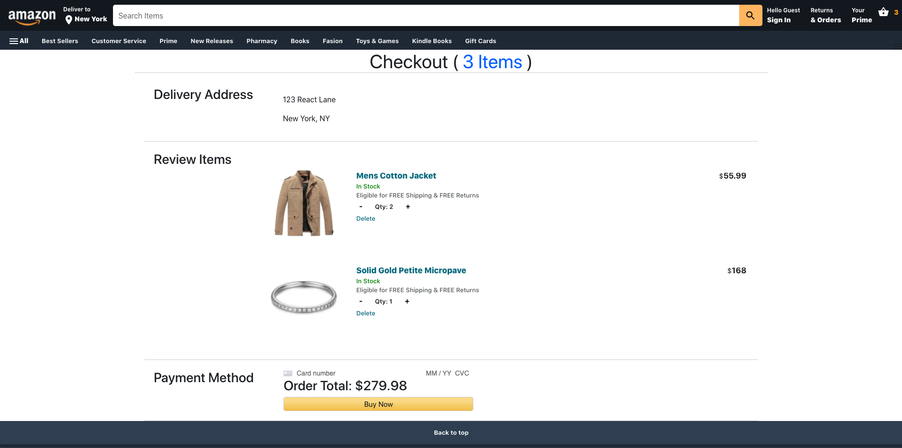

<!-- PROJECT TITLE -->
<p align="center">
  <!-- PROJECT INTRO -->
  <h1 align="center">Amazon-Clone</h3>
  <p align="center">
    This is an Amazon-Clone project following tutorial from Clever Programmer with some self-added features.
    <br />
    <a href="https://challenge-64600.web.app/">View Demo</a>
    <br />
    <a href="https://github.com/joanna15202/amazon-clone.git">
      
    </a>
  </p>
  
  <!-- PROJECT SCREENSHOTS -->
  <a href="https://github.com/joanna15202/amazon-clone.git">
    
  </a>
</p>


<!-- TABLE OF CONTENTS -->
<details open="open">
  <summary><h2 style="display: inline-block">Table of Contents</h2></summary>
  <ol>
    <li>
      <a href="#about-the-project">About The Project</a>
      <ul>
        <li><a href="#key-features">Key Features</a></li>
        <li><a href="#built-with">Built With</a></li>
      </ul>
    </li>
    <li>
      <a href="#getting-started">Getting Started</a>
      <ul>
        <li><a href="#prerequisites">Prerequisites</a></li>
        <li><a href="#installation">Installation</a></li>
        <li><a href="#run">Run on Your Local PC</a></li>
      </ul>
    </li>
    <li><a href="#contact">Contact</a></li>
  </ol>
</details>


<!-- ABOUT THE PROJECT -->
## About The Project
Below are the screenshots of main pages. You can also see the live demo [here](https://challenge-64600.web.app/). 

**Login Page:**
<p align="center">  
  <!-- PROJECT SCREENSHOTS -->
    
</p>

**Checkout Page:**
<p align="center">  
  <!-- PROJECT SCREENSHOTS -->
    
</p>

**Payment Page:**
<p align="center">  
  <!-- PROJECT SCREENSHOTS -->
    
</p>

**Order Page:**
<p align="center">  
  <!-- PROJECT SCREENSHOTS -->
    
</p>

### Key Features

* Responsive layout
* User authentication - Email/Password and Google
* Fakestore API
* Payment processing
* Orders stored by webhook
* Quantity adjustment in cart


### Built With

* React.js
* Express.js
* Redux
* Webhooks
* Stripe
* Bootstrap
* Firestore DB
* Fakestore API
* Firebase Authentication
* Firebase Deployment
* Material UI Icons
* Media-query
* FlipMove


<!-- GETTING STARTED -->
## Getting Started

To get a local copy up and running follow these simple steps.

### Prerequisites

* npm
  ```sh
  $ npm install npm@latest -g
  ```

### Installation

1. Clone the repo
   ```sh
   $ git clone https://github.com/joanna15202/amazon-clone.git
   ```
2. Install NPM packages
   ```sh
   $ npm install
   ```

### Run

1. cd into the project directory
   ```sh
   $ cd amazon-clone
   ```
2. Run the app
   ```sh
   $ npm start
   ```
3. Open a browser, and head over to **localhost:3000**
4. Login and add some products to the cart, play around with it.
5. If you want to test the payments, run:
   ```sh
   $ firebase emulators:start
   ```
   Head over to the payment page, and insert below test card information.
   
6. Boom! You should now see the orders and your previous orders made by the same email.


<!-- CONTACT -->
## Contact

* Email - joanna15202@gmail.com
* LinkedIn - https://www.linkedin.com/in/yu-hsing-joanna-wang/

